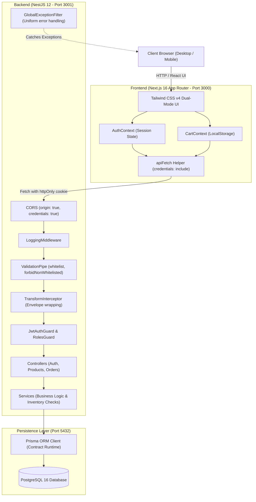
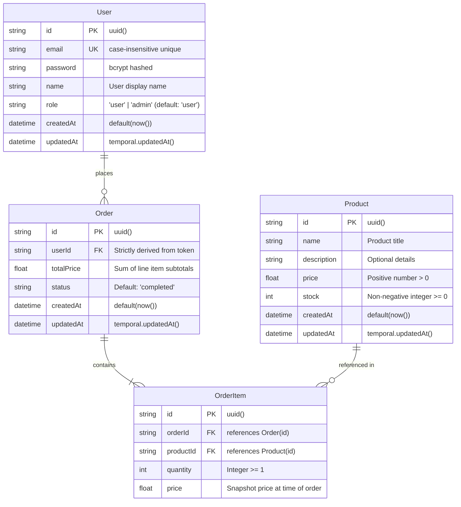
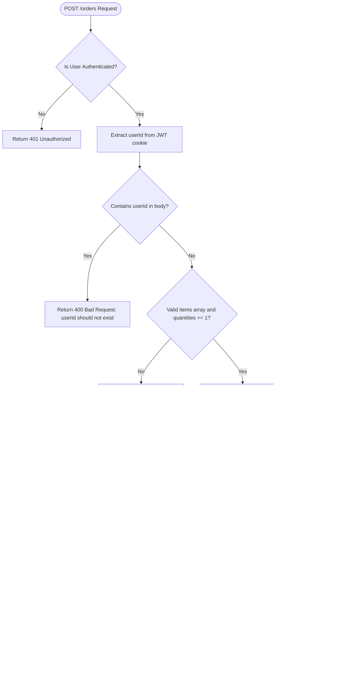

# System Architecture & Technical Specifications

This document outlines the architecture, component interaction, data flow, and database schema for the **NestStore** fullstack application.

---

## 1. High-Level Architecture Overview

NestStore is structured as a decoupled fullstack system composed of:
1. **Frontend**: Next.js 16 (React 19, TypeScript, Tailwind CSS v4, App Router) running on `http://localhost:3000`.
2. **Backend**: NestJS 12 (Express, TypeScript, Prisma 8, Passport JWT, bcrypt) running on `http://localhost:3001`.
3. **Database**: PostgreSQL 16 managed via Prisma ORM contract models.
4. **Containerization**: Multi-stage Dockerfile and Docker Compose orchestration.



---

## 2. Authentication & Session Architecture

NestStore implements **Dual-Mode Authentication**:

```mermaid
sequenceDiagram
    autonumber
    actor Client as User / Browser
    participant FE as Next.js (AuthContext)
    participant BE as NestJS (/auth)
    participant DB as PostgreSQL

    Note over Client,BE: 1. Login / Authentication Flow
    Client->>FE: Enters email & password
    FE->>BE: POST /auth/login { email, password }
    BE->>DB: Query User by email
    DB-->>BE: User record + hashed password
    BE->>BE: bcrypt.compare(password, hash)
    BE->>BE: Sign JWT token
    BE-->>Client: Set-Cookie: token=<jwt>; HttpOnly; SameSite=Lax; Path=/
    BE-->>FE: 200 OK { success: true, data: { access_token, user } }
    FE->>FE: Update React state & redirect to /products

    Note over Client,BE: 2. Session Hydration on Page Load / Refresh
    Client->>FE: Opens / Refreshes any page
    FE->>BE: GET /auth/me (Browser auto-sends 'token' cookie)
    BE->>BE: JwtAuthGuard validates token
    BE-->>FE: 200 OK { success: true, data: { userId, email, name, role } }
    FE->>FE: Set authenticated user & role permissions

    Note over Client,BE: 3. Logout Flow
    Client->>FE: Clicks Sign Out
    FE->>BE: POST /auth/logout
    BE-->>Client: Clear-Cookie: token=; Max-Age=0
    BE-->>FE: 200 OK { success: true, data: { message: "Logged out" } }
    FE->>FE: Clear user state & redirect to /login
```

### Authentication Characteristics:
1. **`httpOnly` Cookie**: The JWT is stored in an `httpOnly` cookie named `token`. Client-side JavaScript cannot read `document.cookie`, preventing Cross-Site Scripting (XSS) token theft.
2. **Bearer Token Support**: The backend `JwtStrategy` extracts tokens from both `req.cookies.token` and the `Authorization: Bearer <token>` header.
3. **Role-Based Access Control (RBAC)**:
   - `user`: Standard customer role. Can browse catalog, manage cart, place orders, and view past orders.
   - `admin`: Elevated managerial role. Can create, edit, and delete products in the catalog.

---

## 3. Database Schema & Data Models

The Prisma data contract is defined at `simple-store/src/prisma/contract.prisma`:



---

## 4. Order & Inventory Transaction Lifecycle

When placing an order (`POST /orders`), the backend executes strict stock validation:



---

## 5. Security & Request Pipeline

### 1. Request Logging Middleware
Applied globally to all routes in `main.ts`:
- Logs HTTP Method, Request Path, and Response Status Code.
- Computes execution duration for every request.

### 2. Validation Pipe
Configured with strict flags:
```typescript
new ValidationPipe({
  whitelist: true,              // Strips unexpected fields
  transform: true,              // Automatically coerces types
  forbidNonWhitelisted: true,   // THROWS 400 IF UNRECOGNIZED FIELDS ARE SENT
  transformOptions: {
    enableImplicitConversion: true,
  },
})
```

### 3. Global Response Envelope (`TransformInterceptor`)
Transforms all successful `2xx` responses into a standardized structure:
```json
{
  "success": true,
  "data": { ... },
  "timestamp": "2026-09-26T12:00:00.000Z"
}
```

### 4. Global Exception Filter (`GlobalExceptionFilter`)
Standardizes all client (`4xx`) and server (`500`) errors without leaking internal stack traces:
```json
{
  "message": "Error description here",
  "timestamp": "2026-09-26T12:00:00.000Z"
}
```
